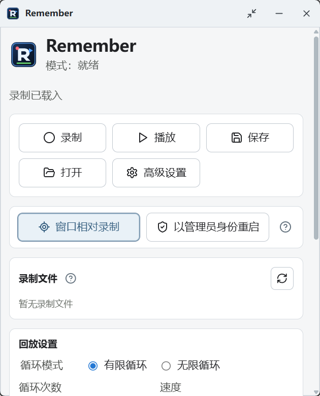
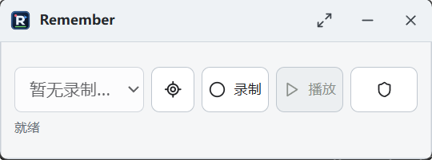

<div align="center">
  
</div>

<h1 align="center">Remember</h1>

<p align="center">轻量、便携、完全本地运行的 Windows 键鼠录制与回放工具。</p>

<p align="center">
  <a href="https://github.com/ReasonW6/Remember/actions/workflows/windows-ci.yml"></a>
  <a href="https://github.com/ReasonW6/Remember/releases/latest"></a>
  
  
  <a href="LICENSE"></a>
</p>

<p align="center">
  <a href="https://github.com/ReasonW6/Remember/releases/latest">下载最新版</a> ·
  <a href="#快速开始">快速开始</a> ·
  <a href="#录制模式">录制模式</a> ·
  <a href="#开发与构建">开发与构建</a> ·
  <a href="README_en.md">English</a>
</p>

<div align="center">
  
</div>

Remember 的使用方式接近 TinyTask：按下快捷键开始录制键盘和鼠标操作，再按一次停止，之后即可重复回放。录制文件保存在本地，不需要账号，也不会上传到网络。

Remember 是原创实现，不包含 TinyTask 的代码、图标、名称、二进制文件或其他资产。

## 功能亮点

- 使用全局快捷键录制和回放真实键盘、鼠标输入。
- 提供 V1 屏幕坐标与 V2 窗口相对坐标两种录制格式。
- V2 在真正执行某一步时才寻找、恢复并激活对应窗口，不会在回放开始时把所有应用唤醒到前台。
- 支持录制过程中才出现的窗口，并在第一次需要操作时等待其出现。
- 标准 Windows `ComboBox` 可按选项名称回放。录制选择“Mihomo”后，即使列表顺序改变，仍会尝试选择“Mihomo”。
- 等待或停止回放时，鼠标旁会显示原因、剩余时间和继续方法；检测到管理员权限不足时会直接给出权限提示，不会误报为等待窗口出现。
- 支持录制库、重命名、删除、导入导出、有限或无限循环、速度和循环间延迟。
- 提供紧凑悬浮窗与完整界面，记住上次使用的界面模式和窗口位置。

## 紧凑界面

<div align="center">
  
</div>

紧凑界面保留录制选择、V1/V2 切换、录制、播放和管理员模式入口，适合长时间放在桌面边缘使用。

## 快速开始

1. 从 [GitHub Releases](https://github.com/ReasonW6/Remember/releases/latest) 下载 `remember.exe`。
2. 把它放在当前用户可写的目录中，例如 `D:\Apps\Remember`。Remember 是免安装便携程序。
3. 运行 `remember.exe`。默认按 `F8` 开始或停止录制，按 `F12` 开始或停止回放。
4. 如需让操作跟随窗口整体移动，在录制前开启“窗口相对录制”。
5. 回放前确认目标窗口、当前焦点和录制来源可信；紧急停止可按 `F8` 或 `F12`。

应用当前不提供自动更新。请通过 Releases 页面获取后续版本。

## 默认快捷键

| 快捷键 | 就绪时 | 录制时 | 回放时 |
| --- | --- | --- | --- |
| `F8` | 开始录制 | 停止录制 | 停止回放 |
| `F12` | 开始回放 | 无操作 | 停止回放 |

快捷键可在高级设置中修改。为避免劫持正常输入，无修饰单键只允许 `F1`–`F24`；字符、编辑和导航键必须与 `Ctrl`、`Alt`、`Shift` 或 `Win` 组合。

## 录制模式

| | V1 屏幕坐标 | V2 窗口相对坐标 |
| --- | --- | --- |
| 默认状态 | 默认启用 | 录制前手动开启 |
| 坐标含义 | 虚拟桌面绝对坐标 | 目标窗口客户区相对坐标 |
| 窗口移动 | 可能导致操作错位 | 可跟随窗口整体平移 |
| 多窗口流程 | 依赖原来的桌面布局和焦点 | 按步骤自动匹配多个目标窗口 |
| 窗口身份 | 不校验 | 校验程序完整路径、窗口类、初始客户区尺寸和 DPI |
| 标准下拉选项 | 按坐标 | 可额外按可见选项名称选择 |
| 隐私数据 | 键鼠输入和时序 | 另含程序路径、窗口类和录制时标题 |

### V2 如何处理窗口

- 每个目标只在第一条有效操作即将执行时自动绑定，不会弹出窗口选择框。
- 没有按住输入的普通鼠标轨迹不会等待、恢复、唤醒或激活后台窗口。
- 录制过程中打开的新窗口可以成为延迟目标。回放会在对应步骤到达后等待最多 30 秒。
- 菜单、下拉列表等短暂表面不会在回放开始时被预先打开。旧文件中的 `ComboLBox` 目标也只在列表真实展开时匹配。
- 如果目标窗口已出现，但完整性级别高于 Remember，回放会立即停止并提示使用管理员身份重新启动。
- 首次绑定要求客户区尺寸与 DPI 兼容；V2 不会理解控件重新布局，也不会自动适配任意缩放或显示缩放变化。

## 录制文件与隐私

每次停止录制后，Remember 会把当前录制自动保存到 `remember.exe` 同级的 `recordings` 文件夹。界面中的“保存”按钮用于另外导出一份 `.remember.json` 文件。

```text
<软件所在目录>\recordings
```

- 单个录制最多 250,000 个步骤，JSON 文件最大 64 MiB。
- 文件列表支持选择、回放、重命名和删除。普通删除需要确认，按住 `Ctrl` 点击删除会直接永久删除。
- 损坏、过大或无法读取的文件会保留在列表中并显示错误，不会被加载或回放。
- 旧版 `%APPDATA%\com.remember.desktop\recordings` 中的文件不会被自动移动或删除。

录制文件是不加密的 JSON，可能包含按键虚拟键码、扫描码、按下与释放时序、鼠标位置，以及 V2 的程序完整路径、窗口类和窗口标题。不要录制密码、令牌或其他敏感信息；共享、备份或上传前请先检查内容。

## 回放安全与权限

- V1 和 V2 都会发送真实的系统键盘与鼠标输入。弹窗、焦点变化或目标内容改变仍可能让操作落到错误位置。
- 无限循环不会自行结束，必须使用播放或停止快捷键终止。
- 停止回放时，Remember 会先释放仍处于按下状态的按键和鼠标按钮，再回到就绪状态。
- 普通权限运行的 Remember 无法可靠读取或控制管理员权限窗口。遇到权限提示时，需要由用户明确选择“以管理员身份重启”；UAC 安全桌面仍必须手动操作。
- 不要直接回放来源不明的 `.remember.json` 文件。

## 下载、校验与签名状态

正式发行文件只从 [GitHub Releases](https://github.com/ReasonW6/Remember/releases) 提供：

- `remember.exe`：Windows x64 优化便携版，供日常使用。
- `remember.exe.sha256`：优化版 SHA-256 校验文件。
- `remember-debug.exe`：调试诊断版，不建议日常使用。
- `remember-debug.exe.sha256`：调试版 SHA-256 校验文件。

**当前发布的 Windows 可执行文件未进行 Authenticode 代码签名。** Windows 可能显示“未知发布者”或 SmartScreen 提示。SHA-256 可以验证下载文件是否与发行页资产一致，但不能证明发布者身份。

正式发行文件由仓库的 Windows CI 从对应源码提交构建，并生成 SHA-256 与 GitHub 构建来源证明。本地构建仅用于开发验证，不应上传到正式发行页。

## 当前限制

- 目前只支持 Windows x64。
- 不是 AI 自动化工具，不使用图像识别，也不会根据界面内容自行决定操作。
- V1 依赖屏幕位置和焦点；V2 可以补偿窗口整体移动，但不支持任意缩放、DPI 变化或内部控件重新布局。
- 浏览器、自绘界面和非标准下拉控件通常只能按坐标回放。
- 录制内容未加密，使用者需要自行保护录制文件。

## 开发与构建

### 环境

- Windows
- Node.js 24.13.1
- Rust 1.94.1 stable
- Tauri 2 的 Windows 构建依赖

仓库 CI 固定使用以上 Node.js 与 Rust 版本。其他新版本可能可以工作，但不属于当前验证基线。

### 本地运行

```powershell
npm install
npm run tauri dev
```

### 验证

```powershell
npm test
npm run build
npm audit --audit-level=moderate
cargo fmt --manifest-path src-tauri\Cargo.toml -- --check
cargo clippy --manifest-path src-tauri\Cargo.toml --all-targets --all-features --locked -- -D warnings
cargo test --manifest-path src-tauri\Cargo.toml --locked
```

CI 还会运行 RustSec 审计、覆盖率阈值检查和真实 Windows 输入往返测试。

### 构建本地应用

```powershell
npm run tauri build
```

本地优化版位于 `src-tauri\target\release\remember.exe`。该文件只用于本地开发验证。

## 许可证

Remember 使用 [MIT License](LICENSE)。
